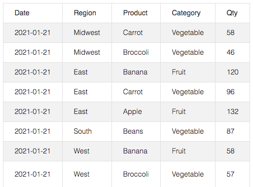
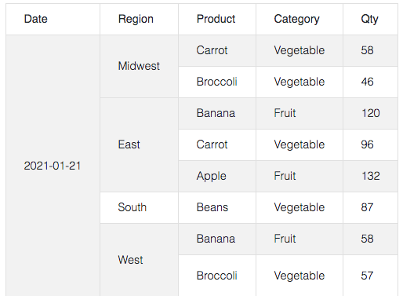

# row-merge

Merge identical table rows jQuery plugin.

<a href="https://jsfiddle.net/andreww1011/wpcv5dgh/">JSFiddle</a>

Easily merge identical table cells in adjacent rows:
<ul>
  <li>cells in adjacent rows with identical text and <code>colspan</code> are merged.</li>
  <li>provide your own matcher function to customize behavior.</li>
  <li>ability to exclude rows in any column from being merged.</li>
</ul>

  <table>
    <tr>
      <td>
        
        
<i>original</i>

      </td>
      <td>
        
        
<i>merged (exclude merging column 4)</i>

      </td>
    </tr>
  </table>

# Usage

  <ol>
    <li>Load jQuery and the plugin bundle in your HTML code.
    <pre><code>&ltscript src="https://code.jquery.com/jquery-3.2.1.slim.min.js"&gt&lt/script&gt
...
&ltscript src="row-merge-bundle.min.js"&gt&lt/script&gt</code></pre></li>
    <li>Define a <code>&lttable&gt</code> element in your HTML code.</li>  
    <li>Use jQuery to target the <code>&lttable&gt</code> and apply the plugin.  The HTML is replaced by the plugin in the DOM.
    <pre><code>&ltscript&gt
  $(function () {
    $('#table').rowMerge();
  });
&lt/script&gt</code></pre></li>
    <li>Or append the class <code>row-merge</code> to the table element and have it be targeted automatically.
    <pre><code>&lttable <b>class="row-merge"</b> ...&gt</code></pre></li>
  </ol>

# Options

The following indexed parameters can be passed to <code>rowMerge()</code> at construction.
  <ul>
    <li><code>matcher</code> - a function of the form <code>function(thisCell: HTMLTableCellElement, otherCell: HTMLTableCellElement) => boolean</code> that accepts two <code>HTMLTableCellElement</code> arguments and returns true if they "match", otherwise returns false.  The implementation is up to the user.  Adjacent rows with identical <code>colspan</code> that "match" will be merged into <code>thisCell</code>.  <i>default behavior: test cell text for equality.</i></li>
    <li><code>excludedColumns</code> - column indicies to exclude from merging.  <i>default=[]</i></li>
    <li><code>zeroIndexed</code> - whether columns are zero-indexed or not.  <i>default=false</i></li>
  </ul>

# API

The following methods are exposed on the plugin:
  <ul>
    <li><code>unmerge()</code> - unmerges the table to original definition in HTML source.</li>
    <li><code>merge()</code> - applies this plug-in and replaces HTML in DOM.</li>
  </ul>

The following global field is exposed on the jQuery extension point:
  <ul>
    <li><code>$.fn.rowMerge.selector</code> - the selector string used to automatically target and apply the plugin. <i> default = "table.row-merge"</i></li>
  </ul>

  
